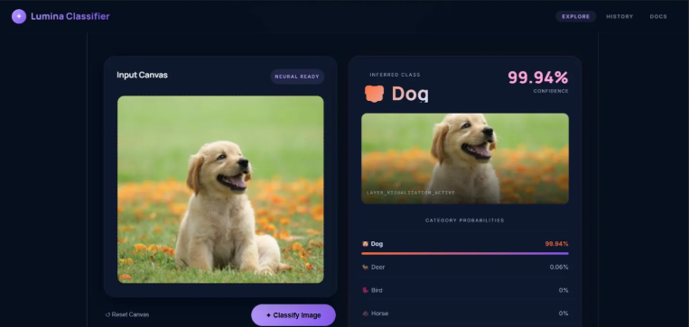

# cifar10-cnn-classifier

A full-stack image classification app — CNN trained on CIFAR-10, served via FastAPI, with a React frontend.

Upload any image and the model returns the top 5 predicted classes with confidence scores.

---

## Demo



---

## How It's Built

### Model
A custom 3-layer CNN built in PyTorch and trained from scratch on the [CIFAR-10](https://www.cs.toronto.edu/~kriz/cifar.html) dataset (60,000 32×32 images across 10 classes).

**Architecture:**
```
Input (3×32×32)
  → Conv2d(3→32) + ReLU + MaxPool     # 32×16×16
  → Conv2d(32→64) + ReLU + MaxPool    # 64×8×8
  → Conv2d(64→128) + ReLU + MaxPool   # 128×4×4
  → Flatten → Linear(2048→256) → ReLU
  → Linear(256→10)
```

Trained with:
- **Optimizer:** Adam (default lr)
- **Loss:** CrossEntropyLoss
- **Epochs:** 10
- **Batch size:** 64
- **Test accuracy:** ~70–72%

### Backend
FastAPI server (`main.py`) that:
1. Loads the trained `model.pth`
2. Accepts image uploads via `POST /classify`
3. Resizes to 32×32, normalizes, runs inference
4. Returns top-5 predictions with class names, icons, and probabilities

### Frontend
React + Vite UI with:
- Drag-and-drop image upload zone
- Live classification results with animated probability bars
- Top predicted class highlighted with confidence score

---

## Project Structure

```
cifar10-cnn-classifier/
├── backend/
│   ├── main.py              ← FastAPI server
│   ├── train.py             ← CNN training script
│   ├── CNN_for_CIFAR10.py   ← Standalone training + eval script
│   ├── dataloader.py        ← CIFAR-10 data loading
│   └── model.pth            ← Trained weights (generated after training)
└── frontend/
    └── src/
        ├── App.jsx
        ├── api.js
        ├── components/
        │   ├── Header.jsx
        │   ├── UploadZone.jsx
        │   ├── ResultCard.jsx
        │   └── EmptyState.jsx
        └── pages/
            └── Home.jsx
```

---

## Setup & Running

### Prerequisites
- Python 3.8+
- Node.js 18+

### Step 1 — Install backend dependencies
```bash
cd backend
pip install torch torchvision fastapi uvicorn python-multipart pillow
```

### Step 2 — Train the model
```bash
python train.py
# Trains for 10 epochs, saves model.pth
# Takes ~3 mins on GPU, ~15 mins on CPU
```

### Step 3 — Start the FastAPI backend
```bash
uvicorn main:app --reload --port 8000
# API running at http://localhost:8000
```

### Step 4 — Set up and start the React frontend
```bash
cd ../frontend
npm install
npm run dev
# UI running at http://localhost:5173
```

---

## API

| Method | Endpoint | Description |
|--------|----------|-------------|
| GET | `/` | Health check |
| POST | `/classify` | Upload image → returns top-5 predictions |

**Response example:**
```json
{
  "predicted_class": "dog",
  "icon": "🐶",
  "confidence": 99.94,
  "top5": [
    { "class": "dog",  "icon": "🐶", "probability": 99.94 },
    { "class": "deer", "icon": "🦌", "probability": 0.06  },
    ...
  ],
  "device": "cpu"
}
```

---

## Classes

`airplane` · `automobile` · `bird` · `cat` · `deer` · `dog` · `frog` · `horse` · `ship` · `truck`

---

## Tech Stack

| Layer | Tech |
|-------|------|
| Model | PyTorch (custom CNN) |
| Dataset | CIFAR-10 |
| Backend | FastAPI + Uvicorn |
| Frontend | React + Vite |
| Styling | Inline CSS (no framework) |